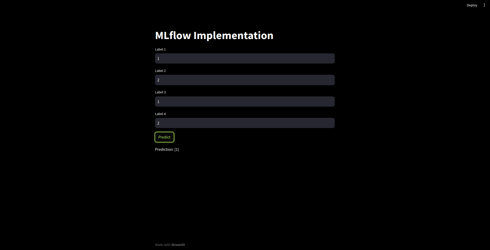

# ml-end-to-end-mlflow-fastapi_example

- This project is an example of how we can make an end-to-end ML project using a MLflow, a logger using generated data using make classification, and a random forest algorithm.
## File Structure
File structure of the project

```.
├── config
│   ├── config.ini
│   └── config.yaml

├── images
│   └── img_pred.png

├── logs
│   ├── logs.log
│   └── system_uses.log
          
├── research
│   └── trials.ipynb

├── src
│   └── mlflow_implementation
│       ├── api
│       │   ├── api_base
│       │   │   ├── base.py
│       │   │   └── __init__.py
│       │   └── fastapi_app.py
│       ├── components
│       │   ├── c_1_data_creation.py
│       │   ├── c_2_data_preprocessing.py
│       │   ├── c_4_model_eval.py
│       │   ├── c_5_model_training.py
│       │   └── __init__.py
│       ├── config
│       │   ├── configuration.py
│       │   └── __init__.py
│       ├── constant
│       │   └── __init__.py
│       ├── entity
│       │   ├── config_entity.py
│       │   └── __init__.py
│       ├── __init__.py
│       ├── pipeline
│       │   ├── __init__.py
│       │   ├── stage_1_data_creation.py
│       │   ├── stage_2_data_preprocessing.py
│       │   ├── stage_3_model_training.py
│       │   └── stage_4_model_eval.py
│       ├── services
│       │   ├── example_service.py
│       │   └── __init__.py
│       └── utils
│           ├── __init__.py
│           └── utils.py

├── main_traning.py
├── Dockerfile
├── inference.py
├── params.yaml
├── README.md
├── requirements.txt
└── streamlit_app.py

```
 


## How to Run

1. **Clone the repository:**
    ```bash
    git clone git@github.com:ishworrsubedii/ml-end-to-end-mlflow-fastapi_example.git
    cd ml-end-to-end-mlflow-fastapi_example
    ```

2. **Create and activate the Conda environment:**
    ```bash
    conda create -n mlopsexample python=3.10 -y
    conda activate mlopsexample
    ```

3. **Install required packages:**
    ```bash
    pip install -r requirement.txt
    ```

4. **Retrain the model:**
   ```
   mlflow ui
   ```
   - for accessing MLFlow UI
   - 
    ```bash   
    python3 main_traning.py
    ```
   - For retraning the model, we can also adjust parameters in params. yaml

5. **Perform Inference/Prediction:**
    ```bash
    python3 inference.py
    streamlit run streamlit_app.py
    ```
   - We have to run both programs for inference. py for fastapi post request and streamlit for UI for the prediction.



### Docker
```commandline
```